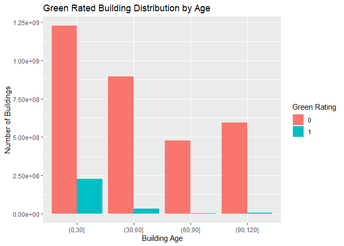
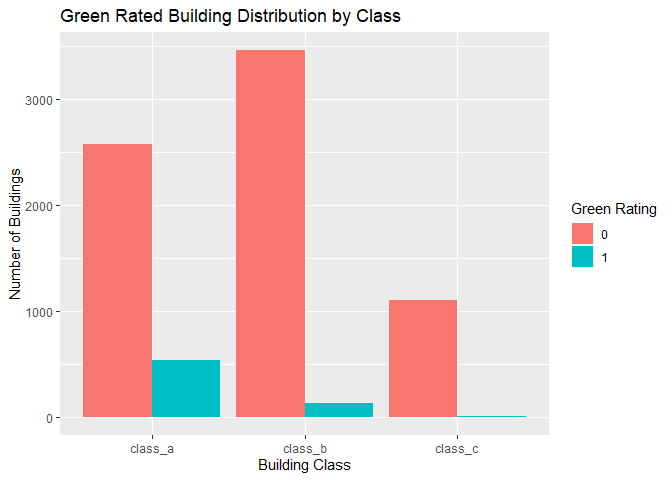
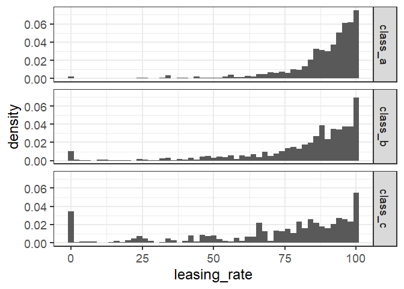
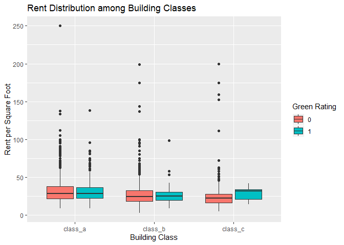
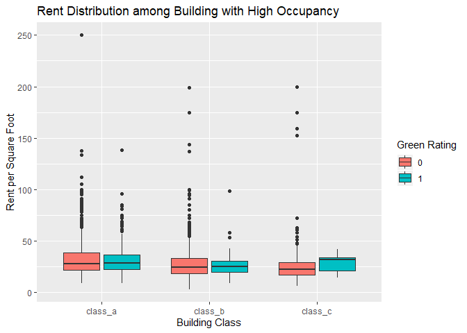
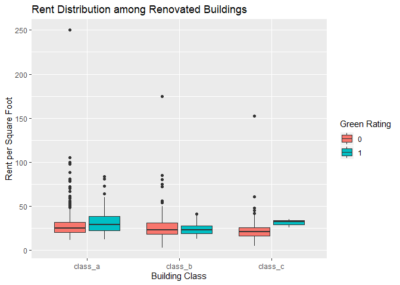
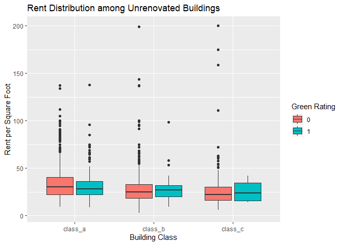
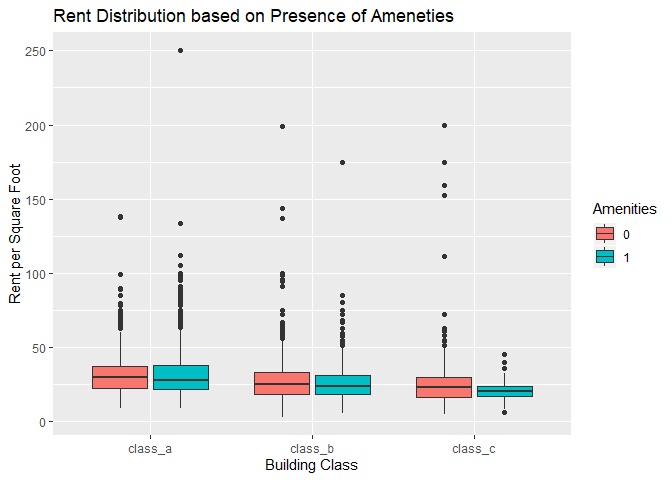
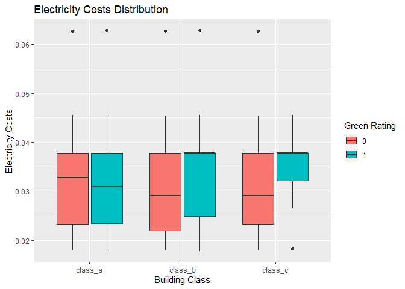
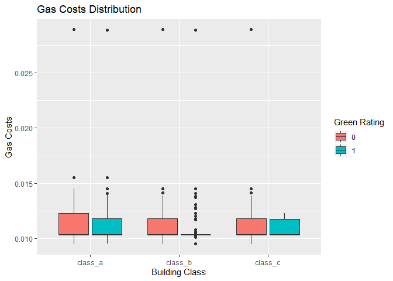

\#\#Case The file greenbuildings.csv contains data on 7,894 commercial
rental properties from across the United States. Of these, 685
properties have been awarded either LEED or EnergyStar certification as
a green building.

An Austin real-estate developer is interested in the possible economic
impact of “going green” in her latest project: a new 15-story mixed-use
building.

The expected baseline construction cost is 100 million, with a 5%
expected premium for green certification. Thus it costs an extra $5
million on the green building.

Will investing in a green building be worth it, from an economic
perspective?

Based on an analysis of this same dataset by an ‘Excel guru’, the
developer was told that the median market rent for green rated buildings
is about $2.60 per square foot more than than for non-green rated
buildings. Based on this analysis, the ‘Excel guru’ hypothesises that
the developer would recuperate these costs in 5000000/650000 = 7.7
years. Even if the occupancy rate was only 90%, they would still
recuperate the costs in a little over 8 years.

Do you agree with these conclusions?

    library(ggplot2)
    library(dplyr)
    library(tidyr)

    buildings = read.csv("greenbuildings.csv")

CLEANING THE DATA 1) Missing data

    sum(is.na(buildings))

    ## [1] 74

    #Only 74 rows with missing info out of the 7,894 rows-omit these 74 missing rows
    buildings = na.omit(buildings)

1.  Factorizing categorical columns

<!-- -->

    #Factorizing categorical columns
    buildings$renovated = factor(buildings$renovated)
    buildings$class_a = factor(buildings$class_a)
    buildings$class_b = factor(buildings$class_b)
    buildings$LEED = factor(buildings$LEED)
    buildings$Energystar = factor(buildings$Energystar)
    buildings$green_rating = factor(buildings$green_rating)
    buildings$net = factor(buildings$net)
    buildings$amenities = factor(buildings$amenities)

EXPLORATORY DATA ANALYSIS

Green Rated Building Distribution by Age:

    buildAgeDist = buildings %>%
      mutate(agecat = cut(age, c(0, 30,60,90,120)))

    buildAgeDist = na.omit(buildAgeDist)

    buildAgeDist = buildAgeDist %>%
      group_by(green_rating,agecat) %>%
      summarize(buildCount = sum(CS_PropertyID))

    ggplot(data = buildAgeDist) + 
      geom_bar(mapping = aes(x=agecat, y=buildCount,
                             fill=factor(green_rating)),
               stat='identity', position ='dodge') + 
      labs(title="Green Rated Building Distribution by Age", 
           y="Number of Buildings",
           x = "Building Age",
           fill="Green Rating")

Green rated building are newer on average.

Green Rated Building Distribution by Building Class:

    #create column for class_c
    buildings$class_c = 0
    buildings[buildings$class_a==0 & buildings$class_b==0,]$class_c = 1
     
    #combine all classes into one categorical column
    buildings$class = names(buildings[c('class_a','class_b','class_c')])[max.col(buildings[c('class_a','class_b','class_c')])]
    buildings$class = factor(buildings$class)

    ggplot(buildings,aes(class)) +
      geom_bar(aes(fill=green_rating),position = 'dodge') +
      labs(title="Green Rated Building Distribution by Class", 
           y="Number of Buildings",
           x = "Building Class",
           fill="Green Rating")

Most green rated buildings are also class A buildings. (Class C has only
7 green rated buildings)

    nrow(buildings[(buildings$class_c == 1) & (buildings$green_rating == 1),])

    ## [1] 7

There are only 7 Class C green rated buildings, which is too small a
sample to trust any results for green-rated class C buildings -
therefore, we will not focus on class C green rated buildings for the
rest of this analysis.

Leasing Rate Distribution by Building Class:

    ggplot(data=buildings) + 
      geom_histogram(aes(x=leasing_rate, stat(density)), binwidth=2) + 
      facet_grid(class~.) +
      theme_bw(base_size=18)

Class A buildings have the highest leasing rate, then Class B, and Class
C has a large number of buildings at a leasing rate of 0%.

Rent Distribution among Building Classes:

    ggplot(buildings,aes(x=factor(class),y=Rent)) +
      geom_boxplot(aes(fill=factor(green_rating))) +
      labs(title="Rent Distribution among Building Classes", 
           y="Rent per Square Foot",
           x = "Building Class",
           fill="Green Rating")

    #Numeric analysis to get median rent of class A and B, green vs non-green
    x1=subset(buildings,(green_rating == 0 & class_a==1))
    nongreen_A_rent = median(x1[,5])
    x2=subset(buildings,(green_rating == 1 & class_a==1))
    green_A_rent = median(x2[,5])

    y1=subset(buildings,(green_rating == 0 & class_b==1))
    nongreen_B_rent = median(y1[,5])
    y2=subset(buildings,(green_rating == 1 & class_b==1))
    green_B_rent = median(y2[,5])

    sprintf("Median rent for non-green class A is %f", nongreen_A_rent)

    ## [1] "Median rent for non-green class A is 28.200000"

    sprintf("Median rent for green class A is %f", green_A_rent)

    ## [1] "Median rent for green class A is 28.440000"

    sprintf("Median rent for non-green class B is %f", nongreen_B_rent)

    ## [1] "Median rent for non-green class B is 24.000000"

    sprintf("Median rent for green class B is %f", green_B_rent)

    ## [1] "Median rent for green class B is 25.100000"

Based on the above box and whisker plots, median rent of Class A green
rated and non-green rated buildings appear to be the same. Median rent
of Class B green rated buildings seems to be slightly higher than its
non-green rated buildings.  
Therefore, it is apparent that green rating by itself does not imply
that the building can charge a higher rent per square foot.

Repeat above plot for only buildings with leasing rate &gt; 50%

    occupied = filter(buildings, leasing_rate > 50)

    ggplot(occupied,aes(x=factor(class),y=Rent)) +
      geom_boxplot(aes(fill=factor(green_rating))) +
      labs(title="Rent Distribution among Building with High Occupancy", 
           y="Rent per Square Foot",
           x = "Building Class",
           fill="Green Rating")

At a leasing rate of greater than 50%, we see a similar trend as before,
with median rent for green rated vs non-green rated for Class A and B
been almost equal.

Rent Distribution among Renovated Buildings by Building Class:

    renovated = filter(buildings, renovated == 1)

    ggplot(renovated,aes(x=factor(class),y=Rent)) +
      geom_boxplot(aes(fill=factor(green_rating))) +
      labs(title="Rent Distribution among Renovated Buildings", 
           y="Rent per Square Foot",
           x = "Building Class",
           fill="Green Rating")

From the renovated buildings, green rated class A buildings has a higher
median rent than non-green class A buildings. However, for class B
renovated buildings, those that are green rated have a LOWER median rent
than those that are not green rated.

Rent Distribution among UN-Renovated Buildings by Building Class:

    renovated = filter(buildings, renovated == 0)

    ggplot(renovated,aes(x=factor(class),y=Rent)) +
      geom_boxplot(aes(fill=factor(green_rating))) +
      labs(title="Rent Distribution among Unrenovated Buildings", 
           y="Rent per Square Foot",
           x = "Building Class",
           fill="Green Rating")

It is interesting to see that for Class A unrenovated buildings, those
that are green rated have a LOWER median rent than those that are not
green rated.

Rent Distribution based on Ameneties:

    #Rent based on ameneties
    ggplot(buildings,aes(x=factor(class),y=Rent)) +
      geom_boxplot(aes(fill=factor(amenities))) +
      labs(title="Rent Distribution based on Presence of Ameneties", 
           y="Rent per Square Foot",
           x = "Building Class",
           fill="Amenities")

It is interesting to see that buildings that have amenities have a lower
median rent per square foot in buildings belonging to classes A, B, and
C.

Electricity Cost Comparison:

    #Electricity Costs based on green rating
    ggplot(buildings,aes(x=factor(class),y=Electricity_Costs)) +
      geom_boxplot(aes(fill=factor(green_rating))) +
      labs(title="Electricity Costs Distribution", 
           y="Electricity Costs",
           x = "Building Class",
           fill="Green Rating")

Class A green rated buildings does seem to have a lower median
electricity cost, however, its interquartile range for electricity cost
is similar to the non-green rated Class A buildings The median and 3rd
quartile for class B green rated buildings are equal suggesting higher
electricity costs for class B green rated buildings.

Gas Cost Comparison:

    #Gas Costs based on green rating
    ggplot(buildings,aes(x=factor(class),y=Gas_Costs)) +
      geom_boxplot(aes(fill=factor(green_rating))) +
      labs(title="Gas Costs Distribution", 
           y="Gas Costs",
           x = "Building Class",
           fill="Green Rating")

It looks like there is not a lot of variation in median gas costs
amongst the buildings.

Conclusion: The data does not support the ‘Excel guru’s’ conclusion that
they can charge an extra 2.60 of rent per square foot on their
green-rated building compared to the market rate. The data only shows a
$0.24 median increase in rent among the current green rated class A
buildings compared to non-green class A buildings. The data only shows a
1.10 median increase in rent among the current green rated class B
buildings compared to non-green class B buildings. Additionally, we can
see that several other factors explored above, such as ameneties,
leasing rate, building renovation, all play a role in determining the
rent that can be charged.
