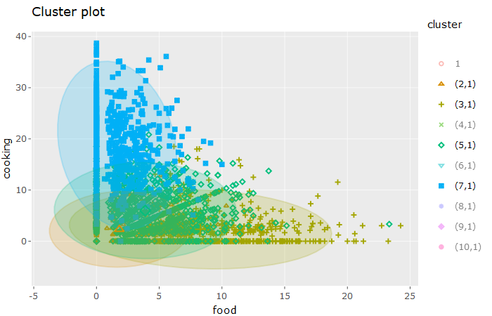

##Case:
The data in social_marketing.csv was collected in the course of a market-research study using followers of the Twitter account of a large consumer brand that shall remain nameless---let's call it "NutrientH20". The goal here was for NutrientH20 to understand its social-media audience a little bit better, so that it could hone its messaging a little more sharply.

Analyze this data as you see fit, and prepare a concise report for NutrientH20 that identifies any interesting market segments that appear to stand out in their social-media audience.

```{r setup, include=FALSE}
knitr::opts_chunk$set(echo = TRUE)
```

```{r, warning=FALSE, message = FALSE}
library(factoextra)
library(plotly)
library(LICORS)
```

K means:

```{r}
social_marketing = read.csv("../../data/social_marketing.csv", header = TRUE, row.names = 1)
```

```{r}
social_marketing$sum = rowSums(social_marketing)

social_marketing = social_marketing[ social_marketing$sum > 25,  ]
social_marketing$sum = NULL

social_marketing = social_marketing / rowSums(social_marketing)
social_marketing = social_marketing * 100
```

```{r}
scaled = scale(social_marketing, center=TRUE, scale=TRUE)
clust_num = 10
set.seed(1)
clust = kmeanspp(scaled, k=clust_num, nstart=100)
```

```{r}
for (i in 1:clust_num){
  assign(paste('cluster', i, sep = '_'), colMeans(social_marketing[which(clust$cluster == i),]))
}
```

```{r}
means = data.frame(do.call(rbind, mget(ls(pattern="^cluster\\_\\d+"))))
```

```{r}
means[ apply(means, 1, max) > 20, ]
```


```{r}
means[ apply(means, 1, max) < 15, ]
```

```{r}
means[means$health_nutrition < 2.75,]
```

```{r}
means[means$personal_fitness < 1.75,]
```

```{r}
for (i in 1:clust_num){
  len = length(which(clust$cluster == i))
  cat("Cluster", i, "has" , len, "members\n")
}

```


To indentify market segments for NutrientH20 we performed clustering. We experimented with different cluster sizes and methods, deciding that k-means with 10 clusters provided the clearest interpretation.

To preprocess our data, we first removed all users whoose volume of tweets fell in the botomn quartile of our data set. With such a low volume of tweets, trends were difficult to indentify, and we reccomend that they be delivered generic marketing. After removing these users, we converted our data for each user to percentage of tweets for each category.


For the rest of our considered users, several trends became apparent:

Cluster 1:

This cluster of 179 users had an average of 21% of tweets categorized as adult material. We believe these are likely pornography accounts/bots.

Cluster 2:

This cluster of 1039 users had an average of 22% of tweets categorized as chatter. We believe that this category may have been overused as a substitute for uncategorized tweets, and that generic marketing is sufficient for this segment.

Cluster 5:

This cluster of 1008 users had an average of 21% of tweets categorized as health_nutrition. Furthermore, looking at the below plot shows that this cluster also has a correlated interest in personal fitness. We reccomend marketing that caters to these interests and consider this our most general target audience.

```{r}
knitr::include_graphics("charts/plotly1.png")
```


Clusters 3 and 7:

These clusters of 635 and 831 users respectively have a moderate focus on cooking and food. Furthermore, looking at a plot of these two categories reveals that our target audience with a focus on health_nutrition and personal fitness lies at the intersection of interest in cooking and food, another potential marketing method that would span several market segmentations.

```{r}

```


Clusters 6, 9, and 10:

These clusters of 1407 users display a low percentage of both the personal_fitness and health_nutrition category (<2.75% health_nutrition, <1.75 personal_fitness). We believe that marketing to these groups should focus on incorporate some other aspect with a high tweet volume. As an example, these clusters have moderate focuses on politics and news that indicate that an article written from a reputable news source on the product benefits may work well as a marketing tool.