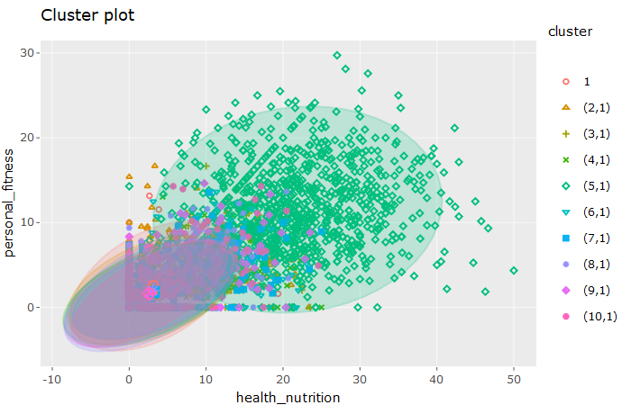
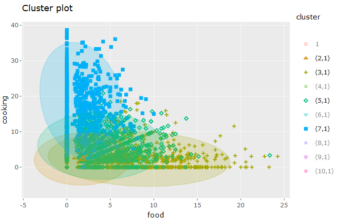

\#\#Case: The data in social\_marketing.csv was collected in the course
of a market-research study using followers of the Twitter account of a
large consumer brand that shall remain nameless—let’s call it
“NutrientH20”. The goal here was for NutrientH20 to understand its
social-media audience a little bit better, so that it could hone its
messaging a little more sharply.

Analyze this data as you see fit, and prepare a concise report for
NutrientH20 that identifies any interesting market segments that appear
to stand out in their social-media audience.

    library(factoextra)
    library(plotly)
    library(LICORS)

K means:

    social_marketing = read.csv("../../data/social_marketing.csv", header = TRUE, row.names = 1)

    social_marketing$sum = rowSums(social_marketing)

    social_marketing = social_marketing[ social_marketing$sum > 25,  ]
    social_marketing$sum = NULL

    social_marketing = social_marketing / rowSums(social_marketing)
    social_marketing = social_marketing * 100

    scaled = scale(social_marketing, center=TRUE, scale=TRUE)
    clust_num = 10
    set.seed(1)
    clust = kmeanspp(scaled, k=clust_num, nstart=100)

    for (i in 1:clust_num){
      assign(paste('cluster', i, sep = '_'), colMeans(social_marketing[which(clust$cluster == i),]))
    }

    means = data.frame(do.call(rbind, mget(ls(pattern="^cluster\\_\\d+"))))

    means[ apply(means, 1, max) > 20, ]

    ##             chatter current_events   travel photo_sharing uncategorized
    ## cluster_1  9.464215       3.722318 4.211237      4.391680      2.211526
    ## cluster_2 22.053345       4.822325 2.689313     13.218867      1.996305
    ## cluster_5  7.650586       3.161374 2.478067      4.279564      1.880478
    ##            tv_film sports_fandom politics     food   family
    ## cluster_1 1.597180      2.878415 2.909411 2.570712 2.227161
    ## cluster_2 1.828449      2.773351 3.229758 1.824596 1.977275
    ## cluster_5 1.565793      2.070419 2.072082 3.885278 1.336139
    ##           home_and_garden    music     news online_gaming shopping
    ## cluster_1        1.434745 1.290815 2.232524      2.180850 1.988649
    ## cluster_2        1.362976 1.783873 1.415653      1.600887 8.741066
    ## cluster_5        1.101366 1.310702 1.891536      1.652822 2.256817
    ##           health_nutrition college_uni sports_playing  cooking      eco
    ## cluster_1         3.135399    2.259088      0.9154846 2.408023 1.582185
    ## cluster_2         2.783370    2.520667      1.2578700 2.312371 1.639105
    ## cluster_5        21.901698    1.658014      1.1309516 5.973493 1.535260
    ##           computers  business  outdoors   crafts automotive       art
    ## cluster_1 1.6498048 0.6522555 2.3660792 1.215372   2.217233 1.6250173
    ## cluster_2 1.3542751 1.3975967 0.9461259 1.184657   2.135009 0.8905267
    ## cluster_5 0.9814402 0.7642707 4.7630644 1.018884   1.049197 1.1484331
    ##           religion    beauty parenting    dating    school
    ## cluster_1 1.581265 1.0771657  2.204632 1.0308190 1.6667243
    ## cluster_2 1.171794 0.7478535  1.290339 0.8668087 1.4816626
    ## cluster_5 1.345077 0.7822271  1.293904 1.4568339 0.9715465
    ##           personal_fitness  fashion small_business        spam      adult
    ## cluster_1         2.551507 1.469916      1.2644200 0.495347105 21.3208262
    ## cluster_2         1.991000 1.409498      0.9440442 0.000000000  0.3573862
    ## cluster_5        11.532114 1.262572      0.4635387 0.003100955  0.3713570

    means[ apply(means, 1, max) < 15, ]

    ##            chatter current_events   travel photo_sharing uncategorized
    ## cluster_3 7.323138       3.345225 2.403059      4.084620      1.461889
    ## cluster_6 8.541926       4.413056 4.361579      5.085641      3.171853
    ## cluster_9 8.863629       3.578949 2.582574      4.173345      1.644402
    ##             tv_film sports_fandom  politics     food   family
    ## cluster_3  1.716835     10.708184  1.818317 8.285562 4.558409
    ## cluster_6 11.024176      2.784592  2.827874 3.119178 1.373233
    ## cluster_9  2.239365      6.670243 11.447518 2.353806 2.310874
    ##           home_and_garden    music      news online_gaming shopping
    ## cluster_3        1.200219 1.287255  1.503730      1.627938 2.199124
    ## cluster_6        1.641677 4.068994  2.164281      1.241690 2.885456
    ## cluster_9        1.444513 1.373816 13.899527      1.817755 2.054746
    ##           health_nutrition college_uni sports_playing  cooking       eco
    ## cluster_3         2.897513    1.889506       1.245313 2.328041 1.2069217
    ## cluster_6         2.701727    6.323152       1.691564 2.410635 1.1177000
    ## cluster_9         2.633318    1.918307       1.195552 2.051451 0.8597372
    ##           computers  business outdoors    crafts automotive       art
    ## cluster_3 1.2967696 0.8402610 1.120910 1.8666505   1.723200 1.2011042
    ## cluster_6 0.9085427 1.5244290 1.289701 1.9006138   1.028397 7.9831925
    ## cluster_9 0.7611240 0.7396631 2.297531 0.7509744   8.667077 0.9745691
    ##           religion    beauty parenting    dating   school personal_fitness
    ## cluster_3 9.674889 1.8281957  7.150800 0.8776596 4.687163         1.775394
    ## cluster_6 2.391736 1.2978128  1.166995 0.9437737 1.357225         1.705087
    ## cluster_9 1.596230 0.8783967  2.101061 1.1280574 1.654190         1.657648
    ##            fashion small_business spam     adult
    ## cluster_3 1.611724      0.7080248    0 0.5464554
    ## cluster_6 1.596258      1.5695889    0 0.3866649
    ## cluster_9 1.035079      0.4698988    0 0.1750717

    means[means$health_nutrition < 2.75,]

    ##             chatter current_events    travel photo_sharing uncategorized
    ## cluster_10 7.223711       3.083369 14.878964      3.747103      1.348699
    ## cluster_6  8.541926       4.413056  4.361579      5.085641      3.171853
    ## cluster_9  8.863629       3.578949  2.582574      4.173345      1.644402
    ##              tv_film sports_fandom  politics     food   family
    ## cluster_10  1.808022      2.020925 18.392983 2.882625 1.401091
    ## cluster_6  11.024176      2.784592  2.827874 3.119178 1.373233
    ## cluster_9   2.239365      6.670243 11.447518 2.353806 2.310874
    ##            home_and_garden    music      news online_gaming shopping
    ## cluster_10       0.9350043 1.100898  6.066890      1.244372 1.923591
    ## cluster_6        1.6416769 4.068994  2.164281      1.241690 2.885456
    ## cluster_9        1.4445133 1.373816 13.899527      1.817755 2.054746
    ##            health_nutrition college_uni sports_playing  cooking       eco
    ## cluster_10         2.560595    2.361562       1.170831 2.026225 1.0690676
    ## cluster_6          2.701727    6.323152       1.691564 2.410635 1.1177000
    ## cluster_9          2.633318    1.918307       1.195552 2.051451 0.8597372
    ##            computers  business outdoors    crafts automotive       art
    ## cluster_10 6.5999273 1.3704998 1.207338 1.1545055   1.045339 0.7830327
    ## cluster_6  0.9085427 1.5244290 1.289701 1.9006138   1.028397 7.9831925
    ## cluster_9  0.7611240 0.7396631 2.297531 0.7509744   8.667077 0.9745691
    ##            religion    beauty parenting    dating    school
    ## cluster_10 1.984112 0.7105320  1.503602 1.6903679 0.8961114
    ## cluster_6  2.391736 1.2978128  1.166995 0.9437737 1.3572253
    ## cluster_9  1.596230 0.8783967  2.101061 1.1280574 1.6541901
    ##            personal_fitness  fashion small_business        spam     adult
    ## cluster_10         1.625974 1.031256      0.8639631 0.003207596 0.2837044
    ## cluster_6          1.705087 1.596258      1.5695889 0.000000000 0.3866649
    ## cluster_9          1.657648 1.035079      0.4698988 0.000000000 0.1750717

    means[means$personal_fitness < 1.75,]

    ##             chatter current_events    travel photo_sharing uncategorized
    ## cluster_10 7.223711       3.083369 14.878964      3.747103      1.348699
    ## cluster_4  7.728062       2.842543  2.800026      4.720825      1.414335
    ## cluster_6  8.541926       4.413056  4.361579      5.085641      3.171853
    ## cluster_9  8.863629       3.578949  2.582574      4.173345      1.644402
    ##              tv_film sports_fandom  politics     food   family
    ## cluster_10  1.808022      2.020925 18.392983 2.882625 1.401091
    ## cluster_4   2.295227      2.393345  2.026878 2.141258 1.926070
    ## cluster_6  11.024176      2.784592  2.827874 3.119178 1.373233
    ## cluster_9   2.239365      6.670243 11.447518 2.353806 2.310874
    ##            home_and_garden    music      news online_gaming shopping
    ## cluster_10       0.9350043 1.100898  6.066890      1.244372 1.923591
    ## cluster_4        1.0567967 1.118788  1.327471     18.632801 1.870955
    ## cluster_6        1.6416769 4.068994  2.164281      1.241690 2.885456
    ## cluster_9        1.4445133 1.373816 13.899527      1.817755 2.054746
    ##            health_nutrition college_uni sports_playing  cooking       eco
    ## cluster_10         2.560595    2.361562       1.170831 2.026225 1.0690676
    ## cluster_4          2.981650   18.900556       4.668243 2.278526 0.8364272
    ## cluster_6          2.701727    6.323152       1.691564 2.410635 1.1177000
    ## cluster_9          2.633318    1.918307       1.195552 2.051451 0.8597372
    ##            computers  business outdoors    crafts automotive       art
    ## cluster_10 6.5999273 1.3704998 1.207338 1.1545055   1.045339 0.7830327
    ## cluster_4  0.8968400 0.6335197 1.055209 0.9480462   1.543083 2.0068747
    ## cluster_6  0.9085427 1.5244290 1.289701 1.9006138   1.028397 7.9831925
    ## cluster_9  0.7611240 0.7396631 2.297531 0.7509744   8.667077 0.9745691
    ##            religion    beauty parenting    dating    school
    ## cluster_10 1.984112 0.7105320  1.503602 1.6903679 0.8961114
    ## cluster_4  1.165841 0.5713605  1.175720 1.0910012 0.8228362
    ## cluster_6  2.391736 1.2978128  1.166995 0.9437737 1.3572253
    ## cluster_9  1.596230 0.8783967  2.101061 1.1280574 1.6541901
    ##            personal_fitness  fashion small_business        spam     adult
    ## cluster_10         1.625974 1.031256      0.8639631 0.003207596 0.2837044
    ## cluster_4          1.620593 1.273406      0.7070570 0.002214839 0.5256127
    ## cluster_6          1.705087 1.596258      1.5695889 0.000000000 0.3866649
    ## cluster_9          1.657648 1.035079      0.4698988 0.000000000 0.1750717

    for (i in 1:clust_num){
      len = length(which(clust$cluster == i))
      cat("Cluster", i, "has" , len, "members\n")
    }

    ## Cluster 1 has 179 members
    ## Cluster 2 has 1039 members
    ## Cluster 3 has 831 members
    ## Cluster 4 has 430 members
    ## Cluster 5 has 1008 members
    ## Cluster 6 has 516 members
    ## Cluster 7 has 635 members
    ## Cluster 8 has 233 members
    ## Cluster 9 has 458 members
    ## Cluster 10 has 433 members

To indentify market segments for NutrientH20 we performed clustering. We
experimented with different cluster sizes and methods, deciding that
k-means with 10 clusters provided the clearest interpretation.

To preprocess our data, we first removed all users whoose volume of
tweets fell in the botomn quartile of our data set. With such a low
volume of tweets, trends were difficult to indentify, and we reccomend
that they be delivered generic marketing. After removing these users, we
converted our data for each user to percentage of tweets for each
category.

For the rest of our considered users, several trends became apparent:

Cluster 1:

This cluster of 179 users had an average of 21% of tweets categorized as
adult material. We believe these are likely pornography accounts/bots.

Cluster 2:

This cluster of 1039 users had an average of 22% of tweets categorized
as chatter. We believe that this category may have been overused as a
substitute for uncategorized tweets, and that generic marketing is
sufficient for this segment.

Cluster 5:

This cluster of 1008 users had an average of 21% of tweets categorized
as health\_nutrition. Furthermore, looking at the below plot shows that
this cluster also has a correlated interest in personal fitness. We
reccomend marketing that caters to these interests and consider this our
most general target audience.

    

Clusters 3 and 7:

These clusters of 635 and 831 users respectively have a moderate focus
on cooking and food. Furthermore, looking at a plot of these two
categories reveals that our target audience with a focus on
health\_nutrition and personal fitness lies at the intersection of
interest in cooking and food, another potential marketing method that
would span several market segmentations.

    

Clusters 6, 9, and 10:

These clusters of 1407 users display a low percentage of both the
personal\_fitness and health\_nutrition category (&lt;2.75%
health\_nutrition, &lt;1.75 personal\_fitness). We believe that
marketing to these groups should focus on incorporate some other aspect
with a high tweet volume. As an example, these clusters have moderate
focuses on politics and news that indicate that an article written from
a reputable news source on the product benefits may work well as a
marketing tool.
